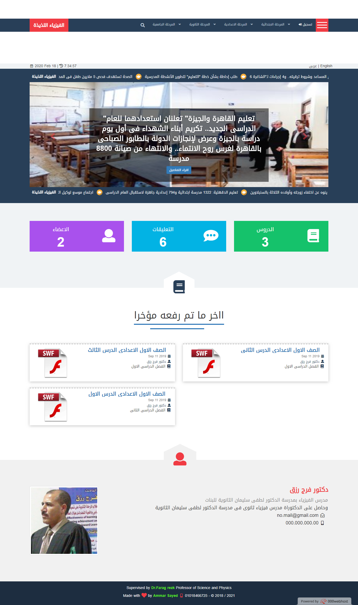

# Deli-Physics
## Deli-Physics is an educational website for learning physics for primary, preparatory, secondary and University the website contains
* lectures
* videos
* images
* exams
* and more

## Deli-Physics Home Page

## Programming Languages
* PHP
* MySQL
* HTML5
* CSS3
* Bootstrap3
* FontAwesome
* WoW.js
* JQuery

## How to use it?
* download the project
* install XAMP
* launch Apache and MySQL
* copy the project in localhost
* run the project using phpMyAdmin
